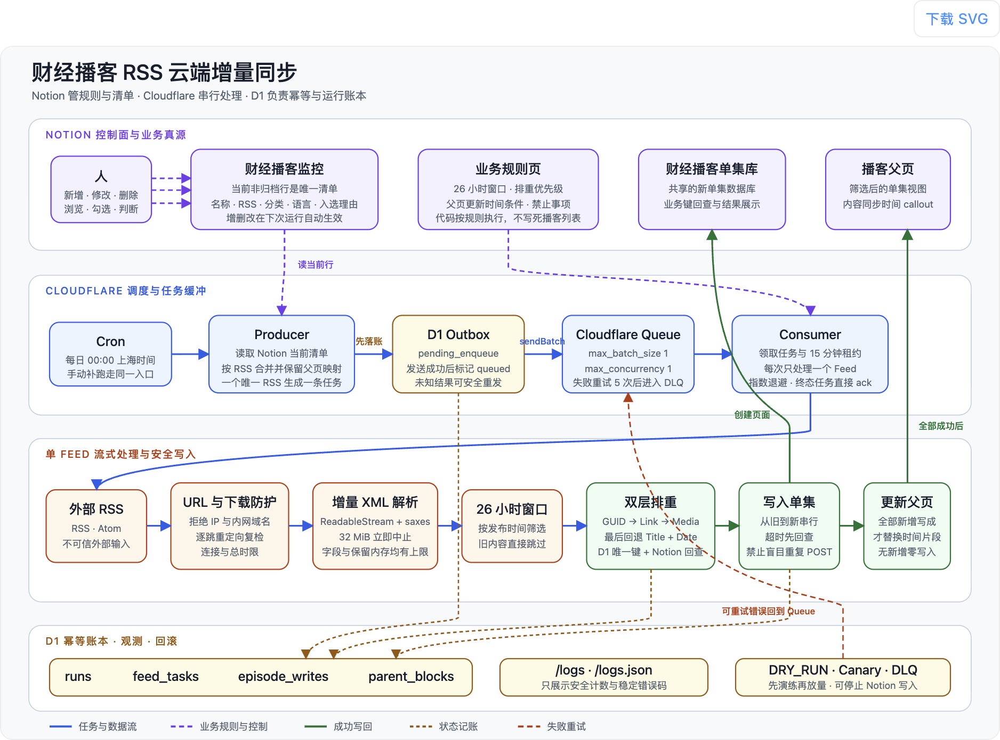

# 财经播客 RSS 云端增量同步

用 Notion 管理播客清单，由 Cloudflare Worker 每天抓取 RSS/Atom，把近 26 小时的新单集严格排重后写回 Notion。整个流程运行在 Cloudflare Cron、Queues 和 D1 上，不依赖常驻服务器，也不需要每天启动 AI 会话。

[](https://deploy.workers.cloudflare.com/?url=https://github.com/wanguolin/cf-worker-notion-podcast-monitor)

> Notion 可复制模板已经完成结构化制作，尚需仓库维护者在 Notion 后台执行一次 **Publish → Duplicate as template**。公开链接会在发布后补到本段；在此之前，请不要使用作者私有数据库的 ID。

如果你习惯让 Codex、Claude Code 等编码 Agent 完成初始化，复制模板后可以直接使用仓库内的 [Agent 初始化提示词](AGENT_SETUP_PROMPT.md)。

## 它解决什么问题

这个项目把“播客清单”和“新单集资料库”都放在 Notion：

- 在「财经播客监控」新增、修改、归档或删除播客，下一次运行自动生效；代码里没有写死播客列表。
- 每个唯一 RSS 只生成一条任务，由 Queue 严格串行处理，避免 Notion API 并发写入。
- 只处理近 26 小时发布的单集，并用“播客名称 + 排重键”在 D1 与 Notion 两层排重。
- 只有某个播客的全部新增单集都成功写入后，才更新该播客父页的“内容同步时间”。没有新增时对 Notion 零写入。
- `/logs` 和 `/logs.json` 提供 7 天滚动观测，只展示安全计数与稳定错误码。

## 架构



数据流可以概括为：

1. Cron 每天 `00:00 Asia/Shanghai`（`0 16 * * *` UTC）触发 Producer，也可通过受保护端点手动补跑。
2. Producer 查询「财经播客监控」的全部当前非归档行；RSS 为空的行跳过。
3. 同一 RSS 的多条父页映射会合并，每个唯一 RSS 生成一个 D1 outbox 任务。
4. 消息成功送入 Cloudflare Queue 后，任务从 `pending_enqueue` 变为 `queued`；发送结果不确定时可以安全重投。
5. Consumer 以 `max_batch_size=1`、`max_concurrency=1` 每次只处理一个 Feed。
6. Feed 下载逐跳做 SSRF 校验，使用 `ReadableStream + TextDecoder + saxes` 增量解析；超过 32 MiB 立即终止，不把整份 XML 放进内存。
7. 只保留 26 小时窗口内的候选，按 `GUID → 原始链接 → 媒体链接 → 标题+发布日期` 生成历史兼容的明文排重键。
8. 先完成全部 Notion 回查，再按发布日期从旧到新写入新单集；创建超时后先回查，禁止盲目重复 POST。
9. 该播客的全部新增单集写入成功后，才最小范围替换父页 callout 中的时间片段；部分失败或无新增都不更新父页。

Queue 是 at-least-once，不保证消息只投递一次。项目用 D1 唯一约束、任务状态抢占和 Notion 业务键回查共同吸收重复投递；可重试错误按指数退避，超过 5 次进入 DLQ。

## 前置条件

- Node.js 20 或更高版本。
- 一个 Cloudflare 账号，并启用 Workers、D1 和 Queues。
- **Workers Paid 计划**：本项目把单次 CPU 上限配置为 `300000 ms`，这是 Paid 计划能力；详见 [Cloudflare Workers limits](https://developers.cloudflare.com/workers/platform/limits/)。
- 一个 Notion 工作区，以及一个只连接本模板页面的 Internal Integration。

## 1. 准备 Notion

### 复制模板

模板发布后，按下面的顺序导入并交给 Agent：

1. 打开本 README 顶部的公开模板链接，点击 **Duplicate**，选择你自己的 Notion 工作区。不要直接在作者模板上配置。
2. 在你的编码 Agent 中启用 Notion Connector/MCP，登录刚才的工作区，并确保复制后的模板根页面对该连接可见。
3. 让 Agent 搜索精确标题「财经播客 RSS 云端增量同步 · 开源模板」，再读取其下两张数据库。Agent 返回的 `collection://...` 标识就是各自的 Data source ID。
4. 另行创建给 Worker 使用的最小权限 Internal Integration，并把复制后的模板根页面共享给它。Agent 的 Connector 和 Worker 的 Integration 是两条独立授权链路。

如果 Agent 搜不到模板，先检查它连接的是不是复制目标所在的工作区、该页面是否对连接可见；不要把 Notion token 粘贴给 Agent 作为替代方案。

公开模板会同时复制两张数据库：

#### 财经播客监控

这是唯一抓取清单。Worker 固定读取以下属性：

| 属性 | 类型 | 用途 |
| --- | --- | --- |
| 播客名称 | Title | 稳定的播客身份；不要随意重命名 |
| RSS地址 | URL | RSS 或 Atom 地址；留空即跳过 |
| 分类 | Select | 写入单集库的分类 |
| 语言 | Select | 写入单集库的语言 |
| 主播 | Text | 展示字段 |
| 入选理由 | Text | 展示字段 |
| 封面 | Files | Gallery 封面 |
| 最后更新 | Last edited time | Notion 系统字段 |

每个播客条目的正文必须且只能有一个 callout，包含下面这行：

```text
内容同步时间：1970-01-01 00:00:00（Asia/Shanghai）
```

模板里附带一条 RSS 为空的安全示例行。复制这条示例来新增播客，并保留 callout；设置好真实播客后可以删除示例行。

#### 财经播客单集库

这是 Worker 的结果库。`单集标题`、`播客名称`、`排重键` 是核心字段，其他字段会按 RSS 实际提供情况尽量填写，不会编造：

`分类`、`语言`、`发布日期`、`上海时间`、`GUID`、`原始链接`、`媒体下载`、`媒体类型`、`媒体长度(Byte)`、`作者`、`时长`、`季`、`集`、`节目类型`、`显式内容`、`RSS分类`、`关键词`、`封面链接`、`逐字稿链接`、`RSS源`、`简介`、`加入时间`、`行更新时间`。

不要把 `播客名称` 或 `排重键` 改成不支持文本筛选的属性类型。Worker 会动态解析字段名，但遇到缺失或歧义时会 fail closed，停止写入。

### 创建最小权限的 Notion Integration

1. 打开 [Notion Integrations](https://www.notion.so/profile/integrations)，创建一个 Internal Integration。
2. Content capabilities 只开启 **Read content、Insert content、Update content**。
3. 回到复制后的模板根页面，选择 **Share / Connections**，只把这一个模板页面（包含两张子数据库）共享给 Integration。
4. 复制 Integration secret，稍后只填入 Cloudflare 的 `NOTION_TOKEN` Secret。不要写进仓库、聊天、日志或 D1。

### 取得两个 Data source ID

Notion API `2026-03-11` 区分 Database ID 与 Data source ID。本项目需要响应中 `data_sources[].id`，不是页面链接里的 Database ID。

先把 Integration secret 只放在当前终端环境中，再分别查询两张数据库：

```bash
export NOTION_TOKEN='你的 Internal Integration secret'
export NOTION_DATABASE_ID='从复制后的数据库链接取得的 Database ID'

curl -sS "https://api.notion.com/v1/databases/${NOTION_DATABASE_ID}" \
  -H "Authorization: Bearer ${NOTION_TOKEN}" \
  -H "Notion-Version: 2026-03-11" \
  | jq '.data_sources[] | {name, id}'
```

把「财经播客监控」和「财经播客单集库」对应的两个 `id` 分别保存下来。若返回 404，通常是还没有把复制后的模板页面共享给 Integration。

## 2. 一键部署到 Cloudflare

点击顶部的 **Deploy to Cloudflare**。Cloudflare 会克隆本仓库到你的 GitHub/GitLab 账号，读取 `wrangler.jsonc`，自动创建并绑定：

- 1 个 Worker；
- 1 个 D1 数据库；
- 1 个 Feed 任务 Queue；
- 1 个 DLQ；
- 每日 Cron Trigger；
- Workers Builds 持续部署。

部署脚本会先以绑定名 `DB` 执行远程 D1 migrations，再发布 Worker。Cloudflare 官方说明见 [Deploy to Cloudflare buttons](https://developers.cloudflare.com/workers/platform/deploy-buttons/)。

部署页面会要求确认两个明文变量，并填写两个受保护的 Secret：

| 名称 | 类型 | 填什么 |
| --- | --- | --- |
| `NOTION_MONITOR_DATA_SOURCE_ID` | 明文 var | 复制后「财经播客监控」的 Data source ID；必须替换作者默认值 |
| `NOTION_EPISODE_DATA_SOURCE_ID` | 明文 var | 复制后「财经播客单集库」的 Data source ID；必须替换作者默认值 |
| `NOTION_TOKEN` | Secret | Notion Internal Integration secret |
| `MANUAL_TRIGGER_TOKEN` | Secret | `openssl rand -hex 32` 生成的随机字符串 |

Data source ID 只负责定位数据库，本身不授予读取或写入权限，因此不需要当作凭证保密；真正的权限来自 `NOTION_TOKEN` 及该 Integration 被分享到的页面范围。ID 可以提交到你的仓库，但不要误用作者模板的 ID。

保持默认 Queue 名时，无需改其他配置。如果在部署页重命名 DLQ，请同时把 `FEED_TASKS_DLQ_NAME` 改成完全相同的名称。

> Cloudflare 的 Deploy 按钮只支持公开的 GitHub/GitLab 仓库。Fork 后如果把仓库改成私有，按钮不能再作为模板源使用，但已经建立的 Workers Builds 不受影响。

### 部署命令为什么是 `npm run deploy`

Cloudflare Workers Builds 的 Deploy command 应保持为：

```bash
npm run deploy
```

目标用户通过部署按钮完成首次部署后，后续推送通常会由 Workers Builds 自动执行这条命令，不需要每次手动部署。不要改成裸 `wrangler deploy`：本项目的 `npm run deploy` 会先运行 `npm run db:migrate:remote`，把 D1 migrations 应用到绑定名 `DB`，成功后才发布 `finance-production` Worker。

## 用 Agent 完成首次配置

Clone 或由部署按钮创建仓库后，在已经打开该仓库的编码 Agent 中发送：

```text
请完整读取并严格执行 AGENT_SETUP_PROMPT.md，完成我的 Notion 模板副本和 Cloudflare Worker 的首次配置。所有 Secret 都只能通过终端交互设置，不要让我粘贴到聊天、代码或日志。
```

完整流程和验收边界见 [AGENT_SETUP_PROMPT.md](AGENT_SETUP_PROMPT.md)。它会让 Agent 自动读取你复制后的两张 Notion 数据库、替换 Data source ID、设置 Cloudflare vars/Secrets、先用 `DRY_RUN=true` 验证，再在获得你明确确认后开启真实写入。

## 3. 部署后验证

先在 Cloudflare Dashboard 找到 Worker 的 `workers.dev` 地址：

```bash
export WORKER_URL='https://你的-worker.workers.dev'
export MANUAL_TRIGGER_TOKEN='部署时填写的随机字符串'
```

健康检查和公开日志：

```bash
curl -sS "$WORKER_URL/health" | jq
open "$WORKER_URL/logs"
```

验证 Notion 连接、两张 Data source schema 与父页 callout：

```bash
curl -sS -X POST "$WORKER_URL/selftest" \
  -H "Authorization: Bearer $MANUAL_TRIGGER_TOKEN" | jq

curl -sS -X POST "$WORKER_URL/parent-check" \
  -H "Authorization: Bearer $MANUAL_TRIGGER_TOKEN" | jq
```

对单个 RSS 做零写入解析测试：

```bash
curl -sS -X POST "$WORKER_URL/rss-selftest" \
  -H "Authorization: Bearer $MANUAL_TRIGGER_TOKEN" \
  -H 'Content-Type: application/json' \
  --data '{"feed_url":"https://example.com/feed.xml"}' | jq
```

确认以上结果后再手动跑完整 Producer：

```bash
curl -sS -X POST "$WORKER_URL/trigger-run" \
  -H "Authorization: Bearer $MANUAL_TRIGGER_TOKEN" | jq
```

也可以在本地 `.env` 只保存 `MANUAL_TRIGGER_TOKEN`，然后运行：

```bash
npm run trigger -- "$WORKER_URL"
```

部署后新版本可能有约 1 分钟传播延迟；若端点短暂返回旧行为，请稍后重试再判断。

## 配置与安全开关

默认参数位于 `wrangler.jsonc`：

| 配置 | 默认值 | 说明 |
| --- | ---: | --- |
| `RSS_WINDOW_HOURS` | `26` | 单集发布时间窗口 |
| `RSS_MAX_BYTES` | `33554432` | 单 Feed 最大 32 MiB |
| `RSS_CONNECT_TIMEOUT_MS` | `15000` | 建连超时 |
| `RSS_TIMEOUT_MS` | `300000` | 下载总超时 |
| `RSS_MAX_REDIRECTS` | `5` | 最大重定向次数，每跳重新做 SSRF 校验 |
| `RSS_MAX_WINDOW_ITEMS` | `100` | 窗口内最多处理的单集数，防止串行队列被恶意 Feed 长时间占用 |
| `MESSAGE_SOFT_DEADLINE_MS` | `720000` | 单任务软截止时间 |
| `DRY_RUN` | `false` | `true` 时停止全部 Notion 写入 |
| `CANARY_FEED_HASHES` | 空 | 非空时只有白名单 Feed 可以真实写入，其他 Feed 强制 dry-run |

建议首次接入自己的模板时先把 `DRY_RUN` 设为 `true`，完成 `/selftest`、`/parent-check` 和一次手动运行后，再改为 `false`。

## 关键不变量

- 排重键格式必须保持 `guid:<原始GUID>`、`link:<url>`、`media:<url>`、`title_date:<title>\n<iso日期>`；不要改成全量哈希，否则旧库会被误判为全部新增。
- 不要把流式解析改成 `response.text()`、`arrayBuffer()` 或 DOM 全量解析。Worker isolate 只有 128 MB 内存。
- 不要移除 URL/IP/重定向的应用层 SSRF 校验，也不要移除 `global_fetch_strictly_public` compatibility flag。
- Notion 请求保持严格串行且不高于约 1 req/s；429/529 必须尊重 `Retry-After`。
- 没有新增时禁止更新父页；部分单集写入失败时也禁止更新父页。
- `/logs` 是公开端点，禁止输出 token、Authorization、完整 Feed URL 和原始错误详情。
- 播客名称参与历史排重身份；确需改名时，先迁移单集库中对应的名称和排重关系。

## 本地开发

```bash
npm install
npm run typecheck
npm test
```

本地启动：

```bash
cp .dev.vars.example .dev.vars.finance-production
# 把占位值替换为你自己的测试值；该文件已被 gitignore
npm run dev
```

常用 Cloudflare 命令：

```bash
npx wrangler types
npm run db:migrate:remote
npm run deploy
```

修改 `wrangler.jsonc` 后必须重新运行 `npx wrangler types`。生产部署包含新 D1 migration 时，应先应用 migration 再发布 Worker；仓库的 `npm run deploy` 已按这个顺序执行。

## HTTP 端点

| 端点 | 鉴权 | 写入 | 用途 |
| --- | --- | --- | --- |
| `GET /health` | 无 | 否 | 健康检查 |
| `GET /logs` | 无 | 否 | 7 天滚动网页日志 |
| `GET /logs.json` | 无 | 否 | 同一份日志的 JSON |
| `POST /selftest` | Bearer token | 否 | Notion 连接与 schema preflight |
| `POST /rss-selftest` | Bearer token | 恒为 dry-run | 单 Feed 下载解析或入队测试 |
| `POST /parent-check` | Bearer token | 否 | 父页同步 callout preflight |
| `POST /trigger-run` | Bearer token | 取决于写入开关 | 手动执行完整 Producer |

## 许可证

本项目采用 [MIT License](LICENSE)。
